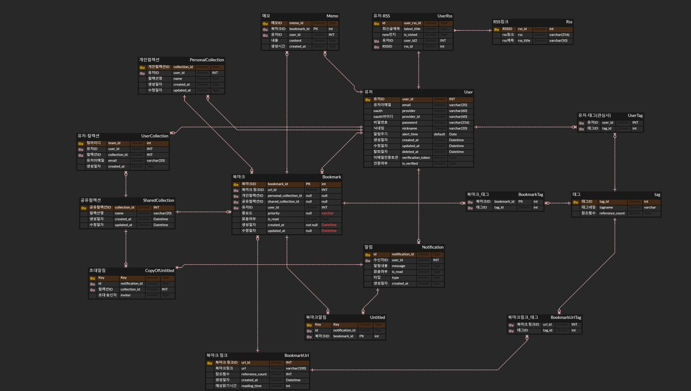

# 🔖 한눈에 보는 북마크 서비스
### 🌟 별담: 별을 담다  
**[북마크 기반 큐레이션] 서비스**  
: 크롬 익스텐션과 태그 기반 추천 기능을 제공하는 **스마트한 북마크 관리 서비스** 

 

## 👥 팀 소개

<table width="500" align="center">
<tbody>
<tr>
<th>Pictures</th>
<td width="100" align="center">

</td>
<td width="100" align="center">

</td>
<td width="100" align="center">

</td>
</tr>
<tr>
<th>Name</th>
<td width="100" align="center">이은지</td>
<td width="100" align="center">김진영</td>
<td width="100" align="center">이학준</td>

</tr>
<tr>
<th>Role</th>
<td width="150" align="center">

 **팀장 
백엔드 리더** 
알림, RSS 담당 
</td>
<td width="150" align="center">

 **백엔드** 
북마크, 컬렉션 담당 
</td>
<td width="150" align="center">

 **백엔드** 
유저, 태그 담당 
 
</td>

</tr>
<tr>
<th>GitHub</th>
<td width="100" align="center">

</td>
<td width="100" align="center">

</td>
<td width="100" align="center">

</td>

</tr>
</table>

<table width="500" align="center">
</tbody>

 

<tbody>
<tr>
<th>Pictures</th>
<td width="100" align="center">

</td>
<td width="100" align="center">

</td>
<td width="100" align="center">

</td>
</tr>
<tr>
<th>Name</th>
<td width="100" align="center">박태현</td>
<td width="100" align="center">이동현</td>
<td width="100" align="center">이성희</td>

</tr>
<tr>
<th>Role</th>
<td width="150" align="center">

 **프론트 리더** 
메인 페이지 담당 
</td>
<td width="150" align="center">

 **인프라 + 프론트** 
유저 페이지 담당 
</td>
<td width="150" align="center">

 **프론트 + 백엔드** 
크롬 익스텐션 담당 
 
</td>

</tr>
<tr>
<th>GitHub</th>
<td width="100" align="center">

</td>
<td width="100" align="center">

</td>
<td width="100" align="center">

</td>

</tr>
</tbody>
</table>

# ✨ 주요 기능 

### 1. 크롬 익스텐션 설치

 

### 2. 익스텐션을 활용한 북마크 저장 

 

### 3. 사용자 관심 태그 기반 북마크 추천

 

### 4. 공유 컬렉션을 통한 북마크 공유 및 소통

##### ❗ 초대 및 강퇴 기능

 

### 5. 태그 기반 검색으로 북마크 찾기

 

### 6. RSS 피드 구독 및 알림 받기

 

### 7. 알림 기능

- 공유 컬렉션 초대 알림

- 사용자 설정 N일 지난 북마크 알림

 

### 8. 기타 기능

##### 로그인 / 회원가입

##### 마이페이지

##### 중요 북마크 및 오래된 북마크 모아보기

 

---
 

## 🌐 사이트
🔗 [별담 서비스 바로가기](https://byeoldam.store)  

### 🧪 테스트 계정  
- **아이디:** `ucs210212@naver.com`  
- **비밀번호:** `1234`  

---
 

## 💡 프로젝트 특장점
#### 1. RSS 연동을 통한 실시간 업데이트 알림
- **구독 중인 뉴스, 블로그, 유튜브** 등 피드가 업데이트되면 알림  

#### 2. 태그 기반 추천 시스템
- **AI 기반 자동 태그 추천**을 통해 개인 맞춤형 북마크 추천  

#### 3. 공유 컬렉션을 통한 협업
- **그룹별 북마크 공유 기능**  
- **북마크 관련 의견을 나눌 수 있는 메모 기능 지원**  

---
 

## 🏆 프로젝트 차별점
#### 1. RabbitMQ 기반 비동기 알림
- **빠르고 안정적인 알림 시스템**을 제공  

#### 2. Redis 기반 이메일 인증
- **빠른 이메일 인증 처리로 사용자 경험 향상**  

#### 3. 크롬 익스텐션 활용
- **북마크 저장, 태그 관리 등 사용자 접근성 극대화**  

#### 4. AI 활용 - 자동 태그 추천 (GPT-3.5 Turbo API)
- **웹페이지 URL과 제목을 분석하여 최적의 태그 추천**  
- **사용자들이 많이 사용하는 태그를 기반으로 추천**  
- **적절한 태그가 없을 경우, 페이지 제목을 기반으로 AI 생성**  

#### 5. Grafana를 활용한 모니터링 시각화
- **대량의 로그를 쉽게 관리**
- **문제 발생 시 경고 메일 기능**

---
 

## 🛠 기술 스택
### Frontend
 

### Backend
 

 

### Database
 

### Infrastructure
  
 
 

---

 

## 📜 산출물 

### 영상
[🔗 서비스 소개 영상](https://www.youtube.com/watch?v=OfSdOV68q54)

### ERD

### Architecture Diagram

### User Flow & Wire Frame
[🔗 User Flow](https://www.figma.com/board/Ce1fyDbZh7lUdKMhZG1E4r/A208---FlowChart?node-id=0-1&p=f&t=gaoDUj24KI55Ow2o-0)
 
[🔗 Wire Frame](https://www.figma.com/design/uAl2EqrRoCL7BtRWtmnprv/A208---WireFrame?node-id=0-1&t=VfCv9iurRQE2e5lK-1)

### API 명세서
[🔗 API Docs](https://eenzzi.notion.site/API-17a45cc04c9d80e4accef604699f301b?pvs=4)

### 팀 노션

 

 
